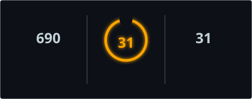

# Hi 👋, I'm human!

  
  
  
  

## 📌 Radiant (Android / Dekstop)

  
  

---

<b>🤍 Languages and Tools</b>

 

<h4>🌐 Web Development</h4>

  

<h4>💻 Programming &amp; Scripting</h4>

  

<h4>📱 Platforms &amp; Tools</h4>

  

<h4>🤖 LLM / IDE</h4>

  

<h4>🧩 Others</h4>

  

<h4>🌍 Social media</h4>

  

<b>🗣️ Languages</b>

 

<table width="100%">
  <thead>
    <tr>
      <th align="left">Language</th>
      <th align="left" style="border-right: 2px solid #30363d;">Level / Status</th>
      <th align="left">Language</th>
      <th align="left">Level / Status</th>
    </tr>
  </thead>
  <tbody>
    <tr>
      <td> <b>Russian</b></td>
      <td style="border-right: 2px solid #30363d;">Native</td>
      <td> <b>Ukrainian</b></td>
      <td>Native</td>
    </tr>
    <tr>
      <td> <b>English</b></td>
      <td style="border-right: 2px solid #30363d;">A2 – B1</td>
      <td> <b>Polish</b></td>
      <td>C1 – C2</td>
    </tr>
    <tr>
      <td> <b>German</b></td>
      <td style="border-right: 2px solid #30363d;">B1 – B2</td>
      <td> <b>Spanish</b></td>
      <td>Learning (A0)</td>
    </tr>
  </tbody>
</table>

<b>📊 GitHub Stats</b>

 

  
  

